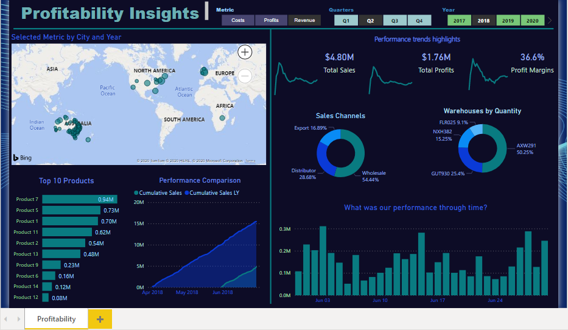

# PowerBI-Dashboard
**Submitted By:** Saloni Gupta\
_Date_: november, 15th, 2020\
**Profitability Insights**  

## Background
Profitability Insight dashboard for a large sales organization based on the US West Coast to highlight profitability in different Regions, Sales trends by Product name, Performance Comparison of current and last year sales, Performance trend highlights, Sales Channels, Warehouse Code by Quantity and Total Profit for the selected time period.

Power BI Desktop 2.87.684.0 64-bit is used to create reports and data visualizations on the dataset.

## Data Modeling

Power BI supports large range of data sources and I have used Excel to get Sales by Regions data (Sales Orders, Customers, AU Regions, Products, Metric Selection).

Created a Relationship between the columns using Create Relationships option that defines how data sources are connected with each other as shown below:-

Also, built custom calculations on the existing tables and these columns can be directly presented into Power BI visualizations. This allows businesses to define new metrics and to perform custom calculations for those metrics. Calculated columns are created in the formula bar, where you can enter DAX- Data Analysis Expression formula to perform calculation. 

## Visualizations
Created Three Slicers - Metric (Costs, Profits, Revenue) , Quarters (Q1, Q2, Q3, Q4), Year (2017, 2018, 2019, 2020).
1) Created Bubble map to showcase Total Sales/Profits/Costs by City and Year.
2) Created Performance Trend Highlights using Line chart to display Total Sales, Total Profits, Profit Margins - Moving Average for past 30 days.
3) Sales Channels Quantity and Warehouses Code by Quantity using Donut Chart.
4) Top 10 Products for Selected Metric (Sales/Profits/Costs) using Stacked Bar Chart.
5) Performance Comparison for Cumulative Sales and Cumulative Sales Last Year using Area Chart.
6) Measuring Performance (of selected metric) through time using Clustered Column Chart.

